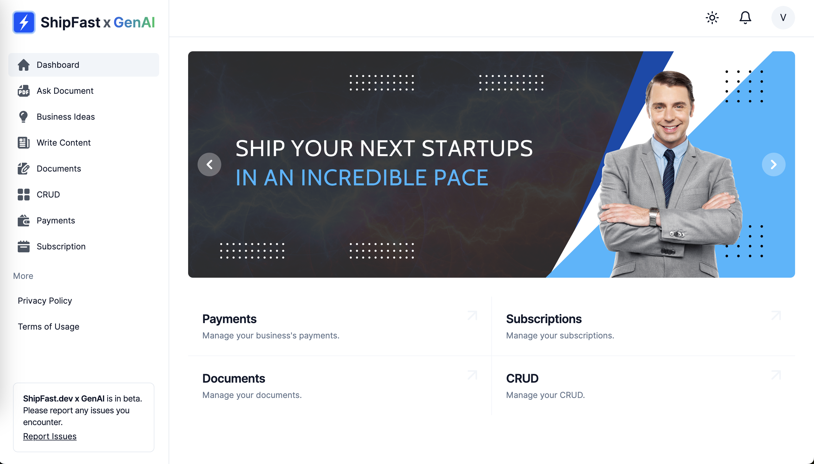

<p align="center">
  
  <h1 align="center">🚀 ShipFast 🚀</h1>
  <p align="center">The best free SaaS source base for GenAI, LLM, and other AI Services!</p>
  <p align="center"><b>Ship your next Generative AI startups in days, not weeks!</b></p>
  <br/>
  <p align="center"><b>NOTE: THIS IS A WORK IN PROGRESS. STAR (⭐) THIS REPO TO FOLLOW UPDATES.</b></p>
</p>

## Roadmap

- [x] Account management (Login/Logout/User Profile)
- [x] Subscription management (Stripe)
- [x] CMS (Contentful)
- [x] Simple OpenAI API integration
- [x] Business idea generator (based on keywords)
- [ ] Chat with different characters
- [ ] Chat with your documents (PDF, Word, etc.)
- [ ] AI writing assistant
- [ ] AI image generator
- [ ] Image search engine



## 1. Run the project

The project is configured to use `pnpm` workspaces, which means that you can install `node_modules` of all packages in
repository, with a single command:

```sh
pnpm install
```

### Start the app

Start both **backend** and **webapp**:

```sh
pnpm shipfast up
```

### Start backend

```sh
pnpm shipfast backend up
```

### Start webapp

```sh
pnpm shipfast webapp up
```

### Local documentation

In order to run your local documentation server execute the following command:

```sh
pnpm shipfast docs up
```

## 2. Tech stack

**Front-end stack:**

The front-end stack is based on **React** and employs **GraphQL** for communication with the back-end. The design was made with **tailwindcss** and **shadcn/ui**.

- [React](https://github.com/facebook/react)
- [GraphQL](https://graphql.org/)
- [Apollo Client](https://github.com/apollographql/apollo-client)
- [tailwindcss](https://github.com/tailwindlabs/tailwindcss)
- [shadcn/ui](https://github.com/shadcn-ui/ui)
- [styled-components](https://github.com/styled-components/styled-components) (optional)
- [jest](https://github.com/jestjs/jest)
- [Storybook](https://github.com/storybookjs/storybook)
- [Vite](https://github.com/vitejs/vite)

**Back-end stack:**

The back-end stack is based on **Python** and **Django**. This will be the best-suited stack for most of the SaaS, especially AI projects, which often use Python as their main language.

- [Python](https://www.python.org/)
- [Django](https://github.com/django/django)
- [Django REST Framework](https://github.com/encode/django-rest-framework)
- [Graphene Django](https://github.com/graphql-python/graphene)
- [dj-stripe](https://github.com/dj-stripe/dj-stripe/)
- [Postgres](https://www.postgresql.org/)

**Infrastructure:**

The target infrastructure is AWS. The project is configured to use AWS CDK to deploy the infrastructure. However, you can run the project locally with `docker-compose` for development purposes.

- [NX](https://github.com/nrwl/nx)
- AWS infrastructure written in [AWS CDK](https://github.com/aws/aws-cdk)
- Github or Bitbucket

**3rd party services:**

- Stripe
- Contentful
- Sentry
- OpenAI

Read more on our documentation website: [https://docs.shipfast.dev/](https://docs.shipfast.dev/).

## 3. References

This project was a fork of [SaaS Boilerplate - Apptension](https://github.com/apptension/saas-boilerplate) with heavy modifications. Thank you Apptension for the great work and generous MIT license.
